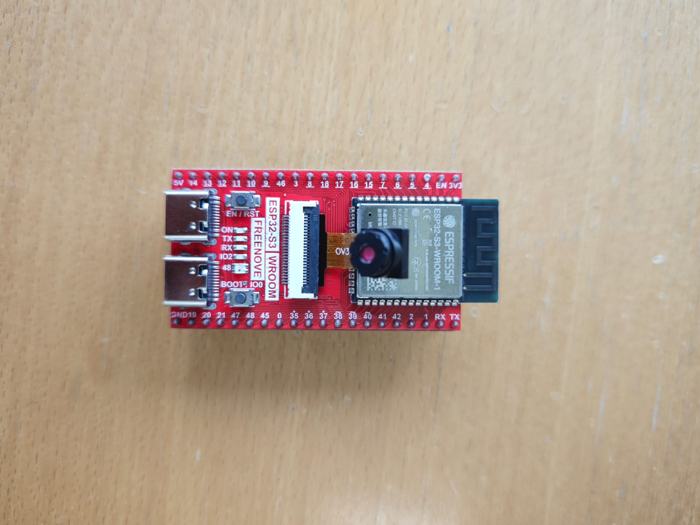
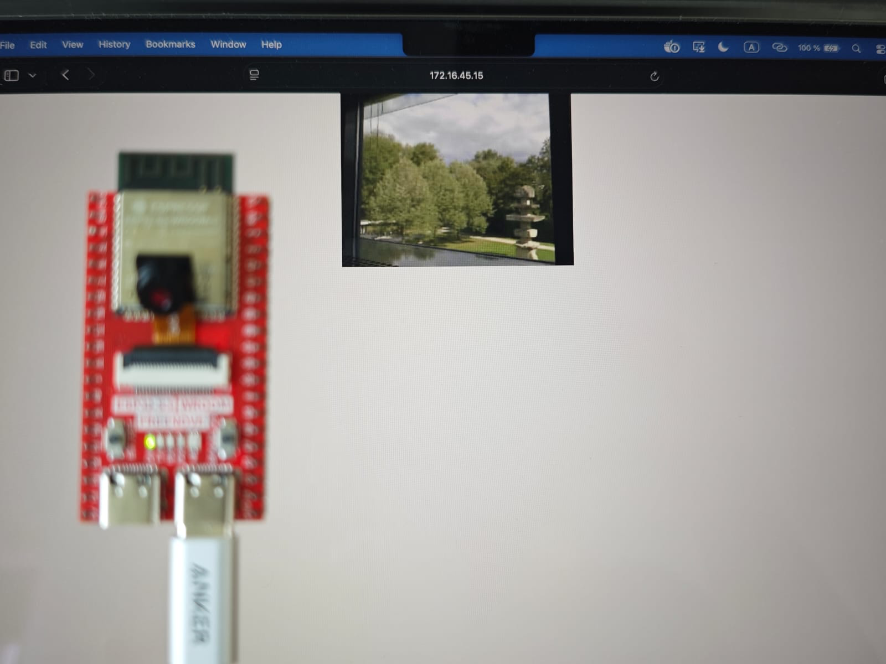

# ESP32 Camera Webserver

A simple camera webserver for the ESP32-S3, built with ESP-IDF. The board connects to your Wi-Fi and serves still images and a live MJPEG stream over HTTP.

 


## Features

- Single JPEG capture at `/jpg`
- Live MJPEG stream at `/stream`
- Modular code: Wi-Fi, camera and HTTP server are separate modules

## Hardware

- ESP32-S3 WROOM board with an OV-series camera (e.g. OV2640)
- PSRAM enabled

Other boards (AI-Thinker ESP32-CAM, WROVER-KIT, XIAO ESP32S3) are supported by selecting their pin map in `main/camera_pinout.h`.

## Project Structure

```
main/
  main.c              Entry point
  wifi_manager.c/.h   Wi-Fi station setup
  camera_manager.c/.h Camera initialization
  http_server.c/.h    HTTP endpoints
  camera_pinout.h     Board pin maps
  personal.h          Wi-Fi credentials (not tracked)
```

## Getting Started

Requires [ESP-IDF](https://docs.espressif.com/projects/esp-idf/en/latest/esp32s3/get-started/) v5.x or newer.

1. Clone the repository:
   ```
   git clone <repo-url>
   cd esp32_camera_webserver
   ```

2. Edit `main/personal.h` with your Wi-Fi credentials:
   ```c
   #ifndef PERSONAL_H
   #define PERSONAL_H

   #define WIFI_SSID "your-ssid"
   #define WIFI_PASS "your-password"

   #endif
   ```

3. Build and flash:
   ```
   idf.py set-target esp32s3
   idf.py build flash monitor
   ```

4. Look for the IP address in the serial monitor, then open:
   ```
   http://<device-ip>/jpg
   http://<device-ip>/stream
   ```

## Notes

- Default resolution is QVGA. Change `frame_size` in `main/camera_manager.c` for higher resolutions.
